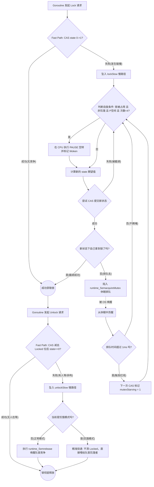

### mutex

### 源码

```go
type Mutex struct {
    state int32
    sema  uint32
}

const (
    mutexLocked = 1 << iota // mutex is locked
    mutexWoken
    mutexStarving
    mutexWaiterShift      = iota
    starvationThresholdNs = 1e6
)
```

- `mutexLocked = 1 << 0` (第 0 位)：**锁标志位**。1 表示锁已被某人占据，0 表示锁当前空闲。

- `mutexWoken = 1 << 1` (第 1 位)：**唤醒标志位**。1 表示当前已经有 Goroutine 被唤醒并在尝试抢锁（或正在自旋）。这个位极其关键，它用于通知正在执行 `Unlock` 的协程：“我已经醒了，你释放锁的时候不要再去底层队列里唤醒其他等待者了，免得造成**惊群效应**”，惊群效应就是当一堆协程在阻塞的时候，阻塞需要的资源来了，然后唤醒了非常多的协程，结果就只有一个协程获得资源然后其他再次进入阻塞，这就导致了资源的浪费。

- `mutexStarving = 1 << 2` (第 2 位)：**饥饿标志位**。1 表示这把锁当前处于极其严苛的“饥饿模式”。

- `mutexWaiterShift = 3` (第 3 到 31 位)：**等待者计数器**。记录当前有多少个 Goroutine 被挂起在底层的信号量（`sema`）队列中。

```go
func (m *Mutex) Lock() {
    if atomic.CompareAndSwapInt32(&m.state, 0, mutexLocked) {
        return
    }
    m.lockSlow()
}
```

        先对比state和0是不是相同，相同就赋值mutexLocke并返回，这样能快速的进行上锁，如果失败的话就进入lockslow，失败则表示state已经上锁了

        下面是对于上锁的处理

```go
func (m *Mutex) lockSlow() {
    var waitStartTime int64
    starving := false
    awoke := false
    iter := 0
    old := m.state
    for {
        //没进入饥饿模式且锁被占用还有判断能否自旋，如果iter太高会被runtime_canSpin阻止自旋
        if old&(mutexLocked|mutexStarving) == mutexLocked && runtime_canSpin(iter) {
            //不存在要抢锁的协程，没有正在唤醒的协程，且又协程在阻塞，如果mutexWoken没有加入就加入，都成功后就唤醒
            if !awoke && old&mutexWoken == 0 && old>>mutexWaiterShift != 0 &&
                atomic.CompareAndSwapInt32(&m.state, old, old|mutexWoken) {
                awoke = true
            }
            //进行自旋
            runtime_doSpin()
            iter++
            old = m.state
            continue
        }
        //不自旋了
        new := old
        if old&mutexStarving == 0 { //没有开启饥饿模式
            new |= mutexLocked //加锁
        }
        if old&(mutexLocked|mutexStarving) != 0 { //要么有锁，要么是饥饿模式
            new += 1 << mutexWaiterShift //增加阻塞协程数量
        }

        if starving && old&mutexLocked != 0 { //预计进入饥饿模式且有锁
            new |= mutexStarving //进入饥饿模式
        }
        if awoke { //有自旋的协程

            if new&mutexWoken == 0 { //mutexwoken与预期不一致
                throw("sync: inconsistent mutex state")
            }
            new &^= mutexWoken //清除mutexwoken
        }
        if atomic.CompareAndSwapInt32(&m.state, old, new) { //没有协程在这期间进行修改
            if old&(mutexLocked|mutexStarving) == 0 {
                break // locked the mutex with CAS
            }
            queueLifo := waitStartTime != 0 //挂起策略
            if waitStartTime == 0 {
                waitStartTime = runtime_nanotime()
            }        
            runtime_SemacquireMutex(&m.sema, queueLifo, 2)//将协程挂起

            //正在饥饿中，或者阻塞时间太久了
            starving = starving || runtime_nanotime()-waitStartTime > starvationThresholdNs
            old = m.state
            if old&mutexStarving != 0 {//如果饥饿标志打开
                //饥饿模式下不需要唤醒标志
                if old&(mutexLocked|mutexWoken) != 0 || old>>mutexWaiterShift == 0 {
                    throw("sync: inconsistent mutex state")
                }
                //上锁且减去一个阻塞协程，因为这个协程要被唤醒了
                delta := int32(mutexLocked - 1<<mutexWaiterShift)
                if !starving || old>>mutexWaiterShift == 1 {//已经不饥饿了且等待协程只有一个
                    delta -= mutexStarving//关闭饥饿模式
                }
                atomic.AddInt32(&m.state, delta)
                break
            }
            awoke = true//这个协程已经醒
            iter = 0
        } else { //失败就重试，乐观锁特性
            old = m.state
        }
    }

}
```

##### runtime_canSpin(iter)自旋检查,判断是否能自旋

- **迭代次数限制 (`iter >= active_spin`)**：自旋最多只能执行 4 次。只要空转了 4 次还没抢到锁，必须停止自旋，坠入休眠队列。

- **多核物理限制 (`ncpu > 1`)**：单核机器绝对不允许自旋。因为单核机器上，你在 CPU 上空转，那个持有锁的协程就永远得不到 CPU 去释放锁，这就是死锁。

- **P 的调度负载 (`gomaxprocs <= int32(sched.npidle+sched.nmspinning)+1`)**：这是最核心的调度器限制。如果当前所有的 P（Processor）都在忙着执行代码，没有空闲的 P，那你就没有资格自旋浪费算力。

- **P 的本地队列为空 (`!runqempty(p)`)**：如果当前 P 的本地队列里还有别的 Goroutine 等着被执行，你绝对不能自旋占着茅坑不拉屎。

        倘若有线程释放了锁，那么等待队列必定会有协程被唤醒，虽然抢不过自旋的协程，但是在唤醒的时候就能够和最久饥饿时间进行比较，这样就能够避免因系统极其空闲，自旋条件完美满足，新来的协程像潮水一样涌来，完美地无缝衔接，一个接一个地在 `Unlock` 的瞬间通过自旋截胡拿到了锁。

```go
func (m *Mutex) Unlock() {

    new := atomic.AddInt32(&m.state, -mutexLocked)//解锁
    if new != 0 {//只有没有锁，没阻塞，没自旋，没饥饿才不会进入慢解锁
        m.unlockSlow(new)
    }


}

func (m *Mutex) unlockSlow(new int32) {
    if (new+mutexLocked)&mutexLocked == 0 { //如果还是处于上锁状态
        fatal("sync: unlock of unlocked mutex")
    }
    if new&mutexStarving == 0 { //若是新状态没有进入饥饿
        old := new
        for {
            //没有阻塞协程或者有锁或有饥饿模式或者有自旋的协程
            if old>>mutexWaiterShift == 0 || old&(mutexLocked|mutexWoken|mutexStarving) != 0 {
                return
            }
            //现在是没锁，没饥饿模式，没自旋的协程且有阻塞的协程
            new = (old - 1<<mutexWaiterShift) | mutexWoken
            if atomic.CompareAndSwapInt32(&m.state, old, new) {
                runtime_Semrelease(&m.sema, false, 2)
                return
            }
            old = m.state
        }
    } else { //进入饥饿直接唤醒协程
        runtime_Semrelease(&m.sema, true, 2)
    }
}
```

下面是状态变化图




### Exp1  用mutex防止竞争

```go
func add(count *int, wg *sync.WaitGroup, mu *sync.Mutex, islock bool) {
    if islock {
        mu.Lock()
    }
    *count = *count + 1
    if islock {
        mu.Unlock()
    }
    wg.Done()
}

func Exp1() {
    var wg sync.WaitGroup
    wg.Add(20000)
    var mu sync.Mutex
    count := 0
    lockcount := 0
    for i := 0; i < 10000; i++ { //无锁加法
        go add(&count, &wg, &mu, false)
    }
    for i := 0; i < 10000; i++ { //加锁的加法
        go add(&lockcount, &wg, &mu, true)
    }
    wg.Wait()
    fmt.Printf("count is :%d\n", count)
    //count is :9821
    fmt.Printf("lockcount is :%d\n", lockcount)
    //lockcount is :10000
}
```

        如果不使用mutex，多个协程对同一个地址进行加操作会导致竞争，有些操作被覆盖，所以需要加锁轮流处理，他们共用的是一个锁
